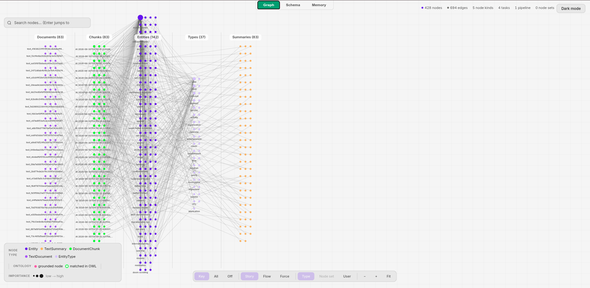
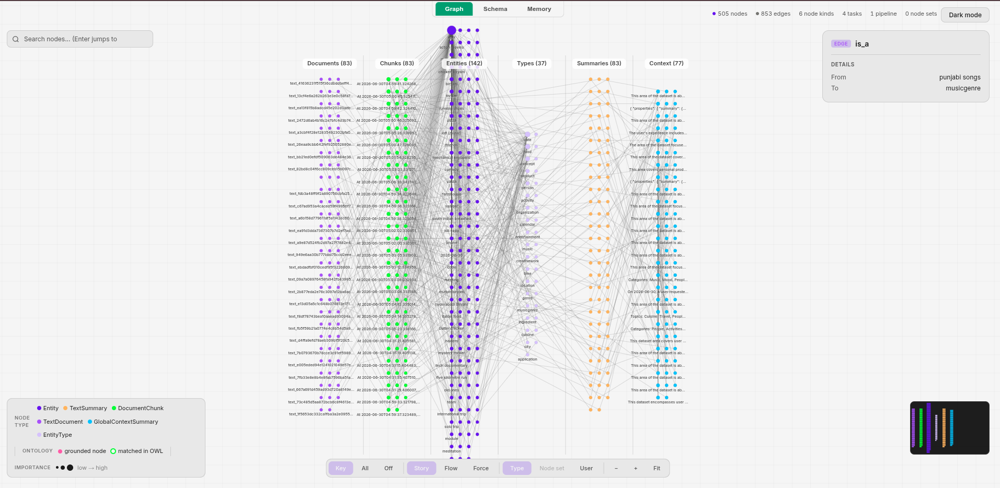

# Krisk — Conversational AI Recommendation Engine

> Talk naturally. Get recommendations from YouTube, Amazon and Zomato — all at once. Now with persistent, graph-based memory powered by [Cognee](https://www.cognee.ai/).


---

## Hackathon Context — WeMakeDevs "The Hangover Part AI" (Cognee Hackathon)

This repo contains two layers, and it's important to be upfront about the line between them:

- **Pre-existing project (built before June 29, 2026):** Krisk itself — the voice-first, multi-agent recommendation engine described below. This was a personal project built prior to the hackathon and is **not** the hackathon submission on its own.
- **Hackathon build (June 29 – July 5, 2026):** Replacing Krisk's original ChromaDB-based conversation memory with **Cognee's graph-vector memory layer**, and driving Cognee's full memory lifecycle — `remember`, `recall`, `improve`, `forget` (and an honest exploration of `memify`). This is the actual submission: a from-scratch integration built during the hackathon window that gives Krisk persistent, relationship-aware memory of user preferences across sessions, plus a **closed feedback loop** where rating a recommendation permanently improves the memory graph.

The commit history reflects that split: the initial commits capture the pre-hackathon baseline, and all commits from `c3009c6` onward are the actual hackathon work.

**AI assistance disclosure:** Significant portions of this hackathon build — the Cognee memory integration, debugging, verification of Cognee's installed API behaviour, and this README — were developed with assistance from Claude (Anthropic). This is disclosed per the hackathon's AI-usage policy.

---

## Cognee Memory Lifecycle — the heart of this submission

This hackathon scores **depth on Cognee's memory lifecycle** highest, so that is where the work went. Every claim below is verified against the *installed* Cognee 1.2.2 behaviour (via node-type diffs on the generated knowledge graph), not just against the docs.

| Verb | Status | Evidence |
|---|---|---|
| `remember` (add + cognify) | ✅ | Every conversation write; a 65-memory persona seed built a **428-node, 694-edge** graph |
| `recall` (search) | ✅ | `CHUNKS` search for literal keyword matching (ranker/forget) + `GRAPH_COMPLETION` for human-readable display + session-tagged recall |
| `forget` | ✅ | Hybrid **LLM-judged** delete, propose-then-confirm guardrailed; verified precise on a 20-memory test (deleted exactly the 5 relevant memories, rejected all 10 false positives) |
| `improve` — structural | ✅ | `build_global_context_index` added **+77 `GlobalContextSummary` nodes** (428 → 505), consolidating scattered preferences; verified by node-type diff |
| `improve` — feedback loop | ✅ | Full `recall → get_session → add_feedback → improve(session_ids)` loop; **+4 nodes** (505 → 509) persisting the rated Q&A and a distilled learning anchored to the right entity |
| `memify` | ⚠️ explored | In 1.2.2, default `memify()` runs only `index_data_points` — verified as a no-op on this graph (509 → 509) *and* on tailored data. Its shipped enrichment tasks are session/feedback primitives that `improve(session_ids=…)` already orchestrates. Honestly reported, not oversold. |

**Result: the full lifecycle demonstrated with concrete, verified evidence — including a closed feedback loop, which most Cognee integrations never reach.**

### The knowledge graph, before and after `improve`

Cognee's `visualize_graph()` renders the actual memory graph as interactive HTML. Watching it grow after consolidation is the clearest proof the memory layer is real:

| Before `improve` (428 nodes, 5 node types) | After `improve` (505 nodes, 6 node types) |
|---|---|
|  |  |

*Interactive versions (open in a browser): [before](docs/graphs/graph_before_improve.html) · [after](docs/graphs/graph_after_improve.html)*

The 6th node type — `GlobalContextSummary` — appears only after `improve`: these are the consolidated, cross-memory summaries (e.g. six scattered biryani mentions distilled into one preference; an action → thriller taste drift caught across separate memories).

### The feedback loop (strongest single result)

```
recall("What food does the user love most?", session_id="…")   → "Biryani."
        │
get_session(session_id)          → retrieve the Q&A + its qa_id
        │
add_feedback(session_id, qa_id, feedback_score=5)   → rate it 5/5
        │
improve(session_ids=[session_id])                   → graph LEARNS from the rating
        │
        └─ +4 permanent nodes: the rated Q&A + a distilled "user loves Biryani most"
           learning, anchored to the existing `biryani` entity
```

Rate a recommendation, and the memory graph permanently improves — anchored to the right entity, not just logged as flat text.

---

## What changed for the hackathon

- `utils/memory.py` (ChromaDB) → `utils/cognee_memory.py` (Cognee knowledge graph)
- Memory agents now read/write through Cognee instead of Chroma
- `ranker_agent` boosts recommendations using Cognee's recalled preference text (via literal `CHUNKS` search — fixed from an earlier `GRAPH_COMPLETION` bug that dropped keywords)
- Hybrid **LLM-judged `forget`**: search narrows candidates → Gemma judges each for relevance → propose-then-confirm before any deletion (fails *safe* — keeps memories if the judge is unreachable)
- **Google Calendar via MCP**: a self-hosted `google-calendar-mcp` server wired into the pipeline, intent-gated and write-guardrailed, so Krisk can reference real calendar events in its replies
- A single persistent background event loop bridges Cognee's async API into the synchronous LangGraph agents; conversation writes run as non-blocking background `cognify()` calls so the user-facing response isn't delayed
- Self-hosted, open-source memory stack: Ollama (Gemma3:12b) for graph extraction

---

## What is Krisk?

Krisk is a voice-first AI recommendation app. Instead of searching across multiple platforms separately, you just talk — and Krisk understands your full intent, fetches results from multiple platforms simultaneously, ranks them intelligently, remembers your preferences across sessions, and speaks the recommendations back to you.

```
You say: "I'm hungry, craving biryani, also need new running shoes and show me tennis highlights"
         │
Krisk understands all 3 intents at once
         │
Recalls your preferences from the Cognee memory graph
         │
Fetches: Zomato food + Amazon products + YouTube videos — in parallel
         │
Ranks YouTube videos using Gemma3:12b vision model (actual video frames)
         │
Replies back with voice — and remembers this interaction for next time
```

---

## Key Features

- **Voice First** — speak naturally, get spoken recommendations back (OpenAI TTS Nova)
- **Multi-Intent Understanding** — detects food, shopping, and entertainment from one sentence
- **Parallel Multi-Platform** — hits Zomato, Amazon and YouTube simultaneously
- **Multimodal Video Ranking** — Gemma3:12b analyzes actual YouTube video frames, not just titles
- **Persistent Graph Memory (Cognee)** — remembers preferences as a knowledge graph, not flat text, and recalls them across sessions
- **Self-Improving Memory** — `improve()` consolidates scattered preferences; a feedback loop lets ratings permanently sharpen the graph
- **Guardrailed Forget** — LLM-judged, confirm-before-delete preference pruning
- **Calendar-Aware** — references real Google Calendar events via a self-hosted MCP server
- **Session Isolation** — each user session has independent memory via LangGraph MemorySaver

---

## Architecture

```
User Voice/Text Input
        │
        ▼
┌─────────────────────────────────────────────────────┐
│                   FastAPI Backend                    │
│                                                      │
│  Gemma3:12b Intent Classifier                        │
│  (followup? vs new request?)                         │
│        │                                             │
│        ▼                                             │
│  ┌─────────────── LangGraph Pipeline ─────────────┐  │
│  │                                                 │  │
│  │  audio → transcript → memory → intent →         │  │
│  │        (Cognee recall)   (Cognee write)         │  │
│  │                    calendar (MCP) → routing     │  │
│  │                                 │               │  │
│  │              ┌─────────────────┐                │  │
│  │              ▼        ▼         ▼               │  │
│  │         [YouTube]  [Zomato]  [Amazon]           │  │
│  │              └─────────────────┘                │  │
│  │                       │                         │  │
│  │                  [Ranker Agent]                 │  │
│  │               (Cognee preference boost)         │  │
│  └─────────────────────────────────────────────────┘ │
│                       │                              │
│              LLM Reply (+ calendar context)          │
└─────────────────────────────────────────────────────┘
        │
        ▼
React Frontend (Voice Orb + Chat + Recommendation Cards)
```

### Cognee Memory Flow

```
intent_agent extracts: {item, category, mood, context}
        │
        ▼
cognee.add(formatted_text) → cognee.cognify()   [background, non-blocking]
        │
Knowledge graph grows: entities (biryani, user, mood) + relationships
        │
        ▼
Next turn: memory_agent calls cognee.search(transcript)  [CHUNKS, literal match]
        │
Graph + vector hybrid search returns relevant recalled facts
        │
        ▼
ranker_agent boosts recommendations matching recalled preferences
        │
Periodically: improve() consolidates the graph; rated recalls feed the feedback loop
```

---

## Tech Stack

### Backend

| Component               | Technology                                   |
| ----------------------- | -------------------------------------------- |
| Framework               | FastAPI (Python 3.12)                        |
| Agent Orchestration     | LangGraph                                    |
| Intent Extraction       | GPT-4o-mini                                  |
| Vision / Graph Extraction | Gemma3:12b via Ollama                      |
| **Conversation Memory** | **Cognee 1.2.2 (knowledge graph + vector hybrid)** |
| Calendar Integration    | Google Calendar via self-hosted MCP server   |
| Speech to Text          | OpenAI Whisper (base)                        |
| Text to Speech          | OpenAI TTS (Nova voice)                      |
| Session Memory          | LangGraph MemorySaver                        |

### Frontend

| Component   | Technology                    |
| ----------- | ----------------------------- |
| Framework   | React 18                      |
| Voice Input | Web Speech API                |
| Styling     | CSS-in-JS (custom dark theme) |

### External APIs

| Platform                  | API                                    |
| ------------------------- | -------------------------------------- |
| YouTube                   | YouTube Data API v3                    |
| Shopping                  | Amazon via RapidAPI                    |
| LLM                       | OpenAI GPT-4o-mini                     |
| Vision / Graph Extraction | Ollama Gemma3:12b (local / remote GPU) |

---

## Getting Started

### Prerequisites

- Python 3.10+, Node.js 18+
- ffmpeg: `sudo apt install ffmpeg`
- Ollama with models pulled: `ollama pull gemma3:12b`, `ollama pull nomic-embed-text`
- Cognee 1.2.2
- API Keys: OpenAI, YouTube Data v3, RapidAPI
- **For calendar features:** a cloned [`google-calendar-mcp`](https://github.com/nspady/google-calendar-mcp) server (cloned *outside* this repo), your own Google Cloud project with an **OAuth Desktop-app** client, and a token generated via that server's `npm run auth`

### 1. Clone the repo

```bash
git clone https://github.com/shanmukh111/Krisk.git
cd Krisk
```

### 2. Backend setup

```bash
cd backend
python3 -m venv venv
source venv/bin/activate
pip install fastapi uvicorn openai langgraph langchain langchain-openai \
    cognee openai-whisper sounddevice httpx ollama python-multipart requests
```

### 3. Configure environment

Create a `.env` file in `backend/`:

```
OPENAI_API_KEY=sk-...
OLLAMA_HOST=http://127.0.0.1:11434
LLM_PROVIDER=ollama
LLM_MODEL=gemma3:12b
EMBEDDING_PROVIDER=ollama
EMBEDDING_MODEL=nomic-embed-text
EMBEDDING_DIMENSIONS=768
# Optional, for calendar features:
GOOGLE_CALENDAR_MCP_ENTRY=/path/to/google-calendar-mcp/build/index.js
GOOGLE_OAUTH_CREDENTIALS=/path/to/gcp-oauth.keys.json
```

### 4. Start Ollama

```bash
ollama serve
```

### 5. Start backend

```bash
uvicorn server:app --port 8000 --host 0.0.0.0
```

### 6. Start frontend

```bash
cd ../convo-frontend
npm install
HTTPS=true npm start
```

### 7. Try the memory lifecycle

```bash
# Seed a persona and build the graph
python seed_memories.py

# Consolidate it and render before/after visualizations
python memory_lifecycle.py both

# Prove the feedback loop (recall → rate → improve → graph learns)
python test_session_improve.py
```

---

## Roadmap

- [x] Multi-agent LangGraph pipeline
- [x] Gemma3 multimodal YouTube ranking
- [x] Voice input/output (Whisper + TTS)
- [x] Session memory and followup detection
- [x] Cognee knowledge-graph memory layer
- [x] `improve()` — structural consolidation (+77 summary nodes) and session feedback loop (+4 nodes)
- [x] `forget()` — hybrid LLM-judged, guardrailed preference pruning
- [x] Knowledge graph visualization (committed under `docs/graphs/`)
- [x] Google Calendar via MCP
- [ ] Knowledge graph visualization embedded in the frontend
- [ ] Gmail via MCP (same pattern as Calendar)
- [ ] Deploy to Railway + Vercel

---

## Author

**Shanmukha Srinivas Regidi** — IIT Goa | AI/ML Developer — [GitHub](https://github.com/shanmukh111)

## License

MIT License — feel free to use, modify and build on top of this.